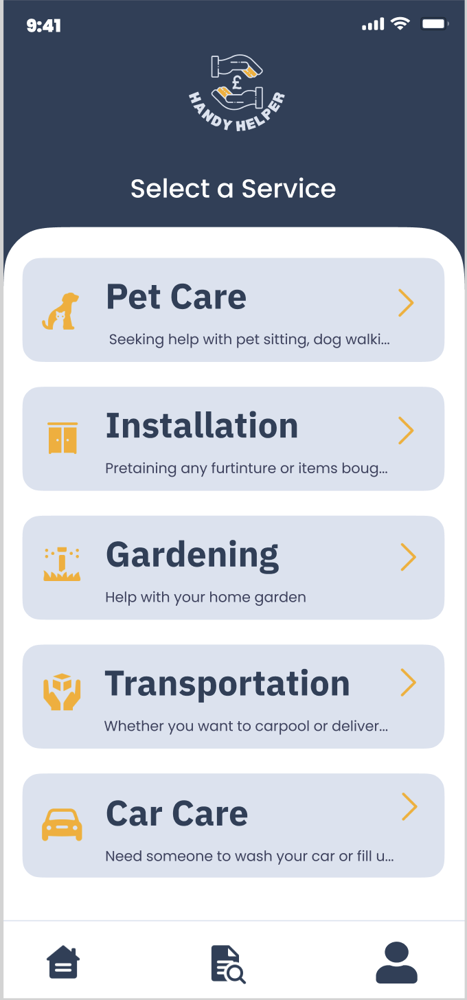
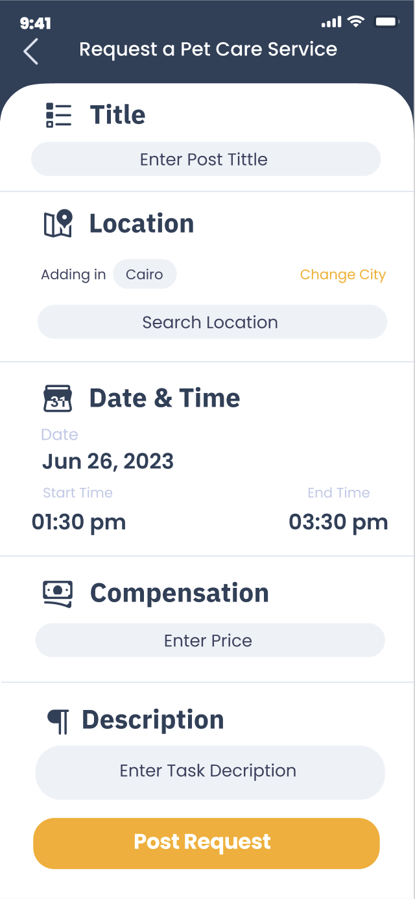
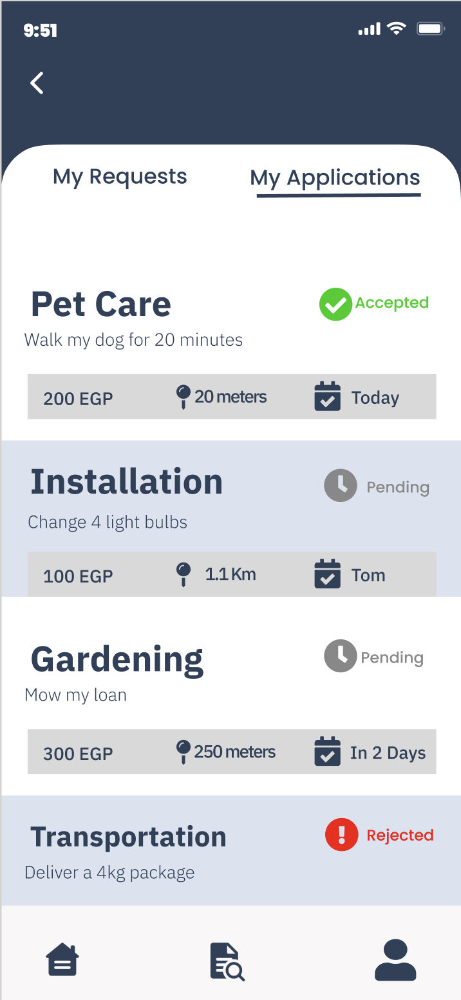
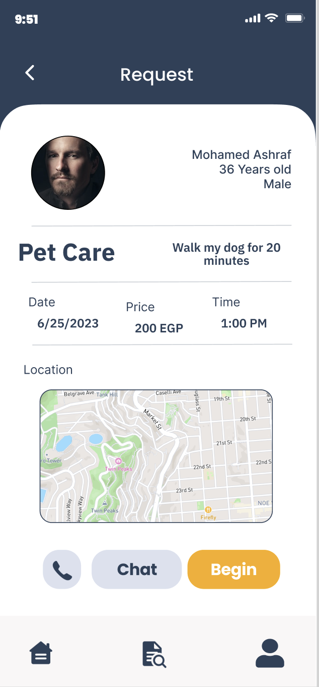

# Handy Helper

Handy Helper is an app that combines all individuals who can offer services like cleaning, moving, electric or plumbing, into one space. Users, who are in need of any of those services can reliably and confidently book people who provide those services by choosing the best one through the ratings and reviews of each service provider.

# Demo
## Request Maker

   
  

## Service Provider

   
  

## Features

- Convenient platform that gathers individuals offering services like cleaning, moving, electric, or plumbing.
- Users can easily book service providers based on ratings and reviews, ensuring reliability and confidence in their choice.
- Eliminates the hassle of finding a good and reliable service provider.
- Provides an opportunity for service providers to earn money quickly through the app.
